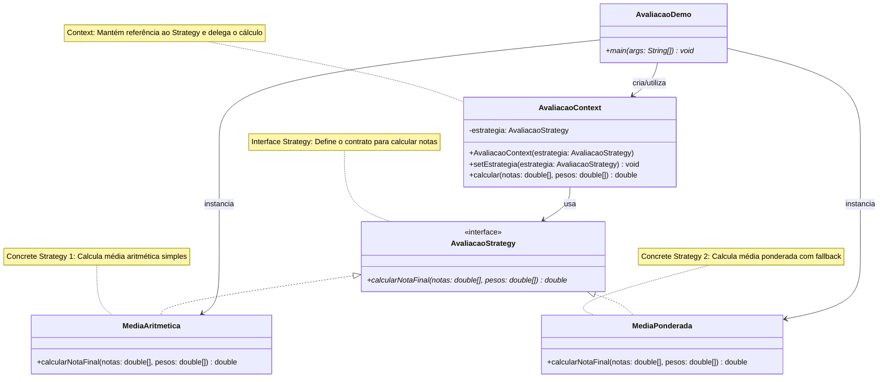

```mermaid
classDiagram
    direction TB
    
    class AvaliacaoStrategy {
        <<interface>>
        +calcularNotaFinal(notas: double[], pesos: double[]) double*
    }
    
    class AvaliacaoContext {
        -estrategia: AvaliacaoStrategy
        +AvaliacaoContext(estrategia: AvaliacaoStrategy)
        +setEstrategia(estrategia: AvaliacaoStrategy) void
        +calcular(notas: double[], pesos: double[]) double
    }
    
    class MediaAritmetica {
        +calcularNotaFinal(notas: double[], pesos: double[]) double
    }
    
    class MediaPonderada {
        +calcularNotaFinal(notas: double[], pesos: double[]) double
    }
    
    class AvaliacaoDemo {
        +main(args: String[])* void
    }
    
    AvaliacaoStrategy <|.. MediaAritmetica
    AvaliacaoStrategy <|.. MediaPonderada
    AvaliacaoContext --> AvaliacaoStrategy : usa
    AvaliacaoDemo --> AvaliacaoContext : cria/utiliza
    AvaliacaoDemo --> MediaAritmetica : instancia
    AvaliacaoDemo --> MediaPonderada : instancia
    
    note for AvaliacaoStrategy "Interface Strategy: Define o contrato para calcular notas"
    note for AvaliacaoContext "Context: Mantém referência ao Strategy e delega o cálculo"
    note for MediaAritmetica "Concrete Strategy 1: Calcula média aritmética simples"
    note for MediaPonderada "Concrete Strategy 2: Calcula média ponderada com fallback"
```
